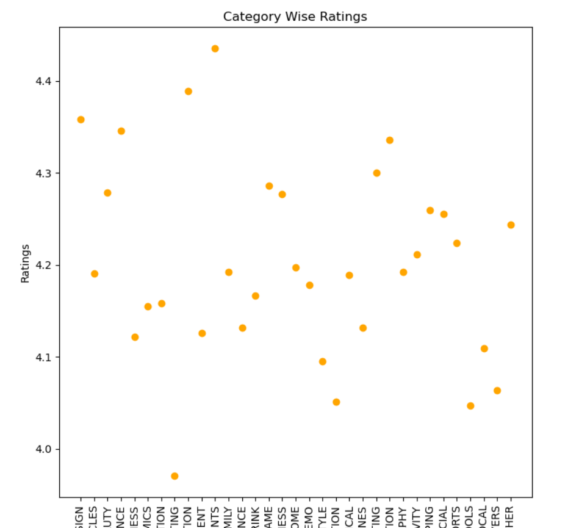
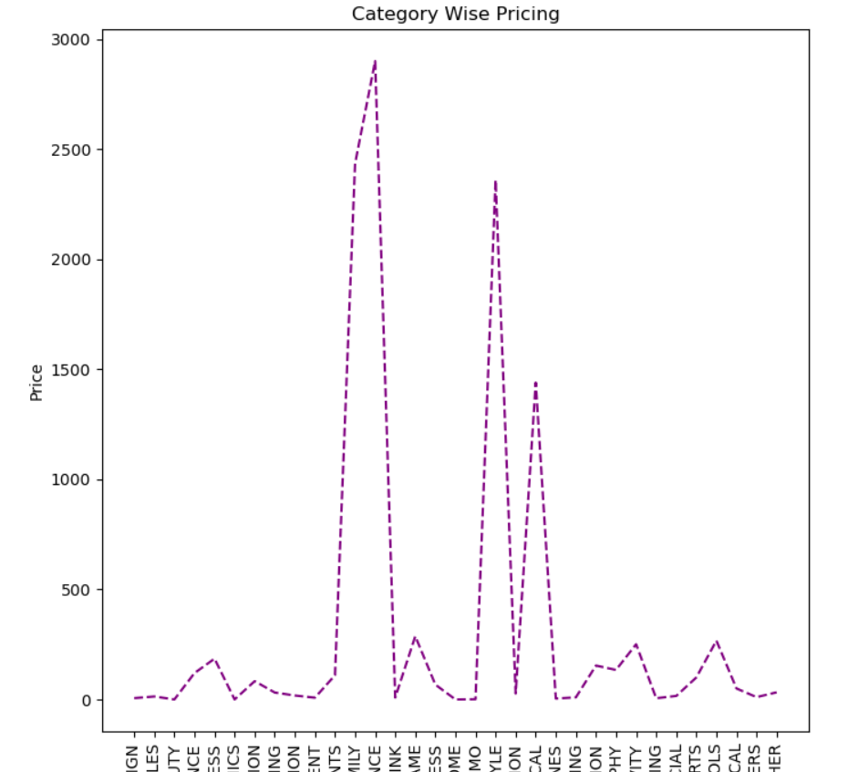
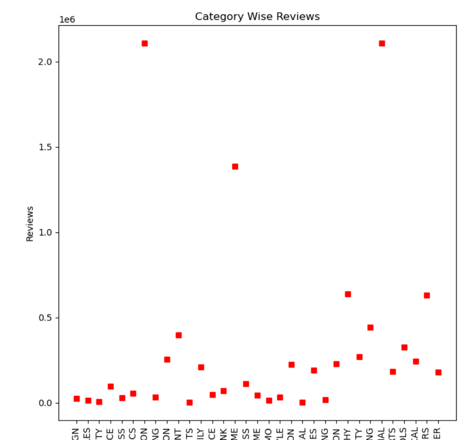

# Data Analysis using Kaggle Dataset
Data Analysis and Visualization of [Google App Rating Dataset](https://www.kaggle.com/lava18/google-play-store-apps) using Python

Includes:

-Data Cleaning

-Data Imputation 

-Data Manipulation 

-Data Visualisation

